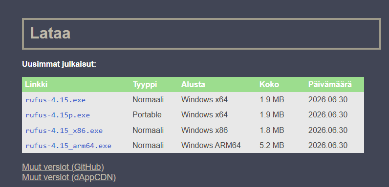
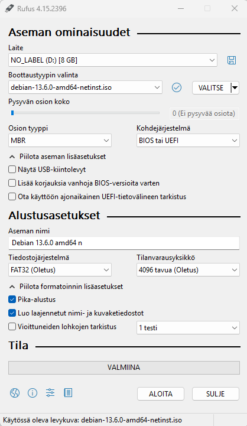
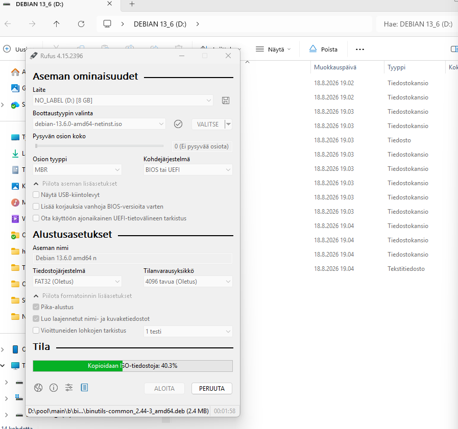
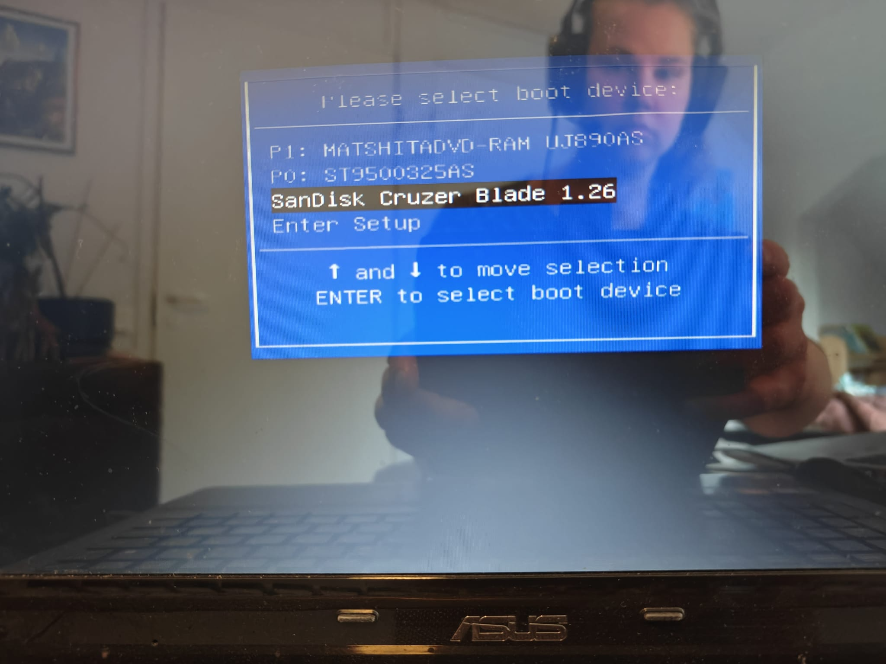
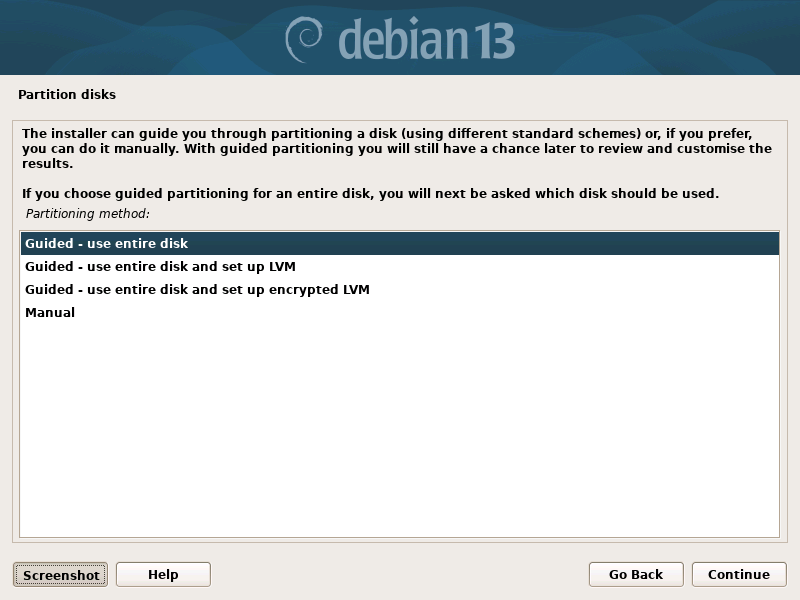
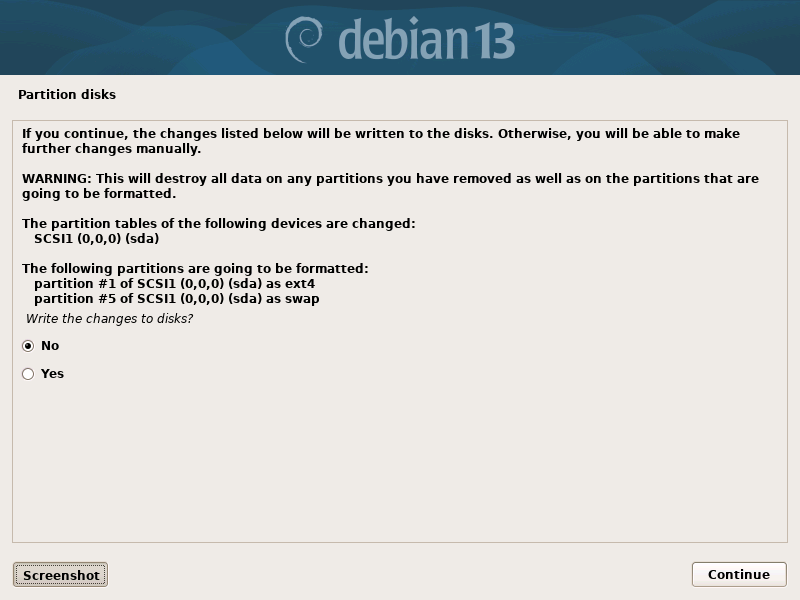
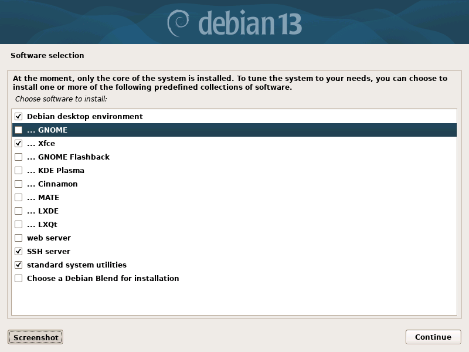
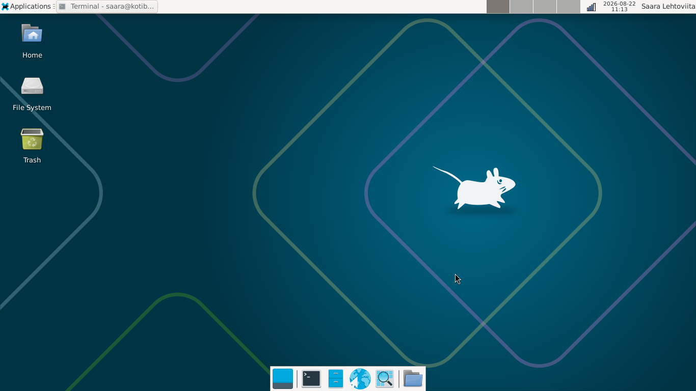

# Week 1

This file consists of a report from the first weeks theme. The first part is a report about my process of installing Linux and the second part is a summary about the article What is Open Source Software and Why use OSS".

## Installing Linux

I am very new to Linux; recently I started my first job in the IT-field and I need Linux-skills there. I have managed to install Linux (DietPi) before on a Raspberry 5 computer. Now I am planning to install Debian on an old laptop and will try to report the steps below.

1. Download Debian

- Go to https://www.debian.org/download

2. Download Rufus

- Rufus is needed for making the usb-stick bootable
  1.  Go to rufus.ie/fi/ and select the version you want to download. I selected the first version.

   2. Download Rufus on usb-stick

3. Flash Debian-image to usb-stick

4. Shut down laptop and insert usb-stick

5. Open laptop, and click on Esc, multiple times if needed (this opens the boot menu)

6. Choose the usb-stick from where installation should be done

7. Follow the installation process

- I pretty much chose the options that where suggested by dfault probably this could have been done with more thought
- For example I don't know how partitioning should be done but since I knew that all on this computer could be deleted, I just chose the default options

- I chose a minimal amount of software to be downloaded during the installation since my laptop is old and not very efficient
  - I had read that Xfce is a lighter Desktop enviroment than GNOME so I chose to use that

8. Extra things after installation

- After the installation I was nervous and excited for if the installation process had gone through but I could log in without problems and now have a working laptop with Linux! In comparison with installing DietPi the process was easy and straight forward. I guess the biggest difficulty I had faced before was that DietPi is very light and comes with nothing extra but Debian seems to come with more included automatically and for example a desktop environment was not installed automatically. Here is how the desktop looks like:

- It took some time to find the screenshots that I took during the installation. Eventually I found them with some help from AI. All the folders under /home were empty and it turned out that I had to give my user sudo rights before I could even make a more advanced search for the screenshots.
- Checking the ip adress for the device: `hostname -I`
- Logging in from another computer using SSH: `saara@192.XXX.XXX.XX`
- Command for logging in as root: `su -`
- Giving sudo rights for my user: `usermod -aG sudo saara`
- Checking in what gropus my user is: `groups saara`
- Rebooting system after group update: `sudo reboot`
- AI suggested that I look for the screenshots like this: `sudo find /var/log/installer -type f | sort`
- Copy all the images from file: `sudo cp /var/log/installer/*.png ~/Pictures/`
- Change owner of file: `sudo chown saara:saara ~/Pictures/*.png`
- From the dcevice command center, for example Windows PowerShell, copy images from Linux-device to this device: `scp saara@192.168.100.14:/home/saara/Pictures/*.png "$env:USERPROFILE\Pictures\"`

## Article summary

This section is a summary of the article "What is Open Source Software and Why use OSS". It's aim is to summarize the article and reflect upon how programs using open source code affect modern technology and digital infrastructure.

Open source software means software that is free for anyone to view, copy and edit. It means that the software has open source code and anyone can for example improve the code if they want. In other cases the code is owned by companies or individuals and users can not usually view the source code and see how the software was created. (Coursera Staff 2025)

### Advantages & Principles

- Community encouragment - anyone wanting to improve the software can participate
- Software updated and changed frequently when developers are engaged and want to see the project succeed
- Transparency - anyone can examine the code and question it  
  (Coursera Staff 2025)

### Open Source Software license types

- Copyleft - content can be modified as wanted but any products that are created must have a copyleft open source license; new products can not for example be called "propietary".
- Public domain - no copyright, users can freely use, copy, distributem change or use the work as they want.
- Permissive - offer most flexibility; anything can be done with the software and new products can be called propietary.
- Lesser general public license: LGPL allows developers to use open source libraries with relatively few restrictions. Modified versions of the library must be released under the LGPL, but the library can otherwise be used in proprietary projects.
  (Coursera Staff 2025)

### Disadvantages

- Compability and security - open source software can have issues with compability, bugs and security vulnerabilities.
- User friendliness - open source software may not always be as userfriendy as propietary software.
- Limited support and guarantees - there may be no single company responsible for support, liability, or guarantees if something goes wrong.
  (Coursera Staff 2025)

### Examples of open source software

Open source software can be a single program or a whole operating system. For example Linux, Mozilla Firefox, Apache HTTP Server and WordPress are open source software. (Coursera Staff 2025)

## Sources

Coursera Staff 31.12.2025. What Is Open Source Software and Why Use OSS? Available: https://www.coursera.org/articles/what-is-open-source-software Read: 22.8.2026
