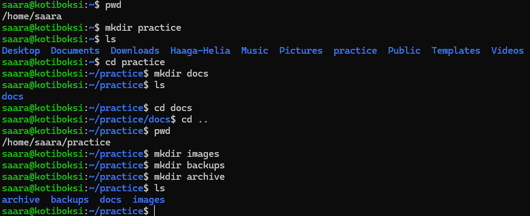
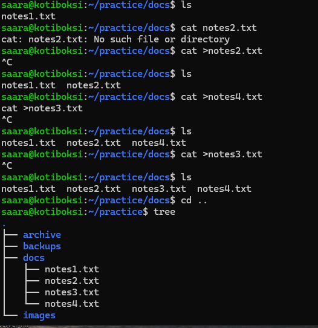
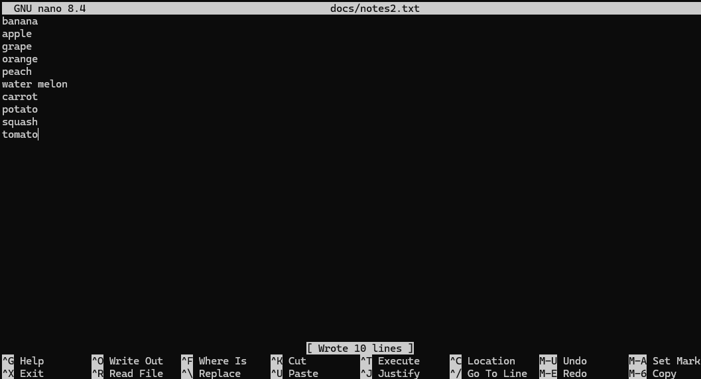
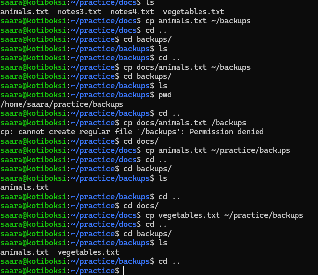
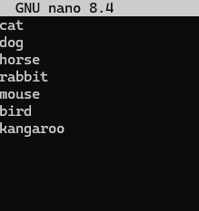
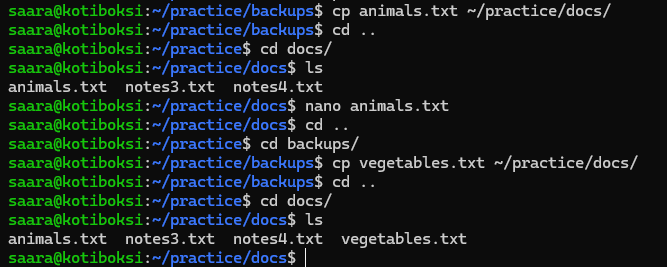
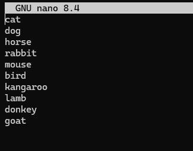
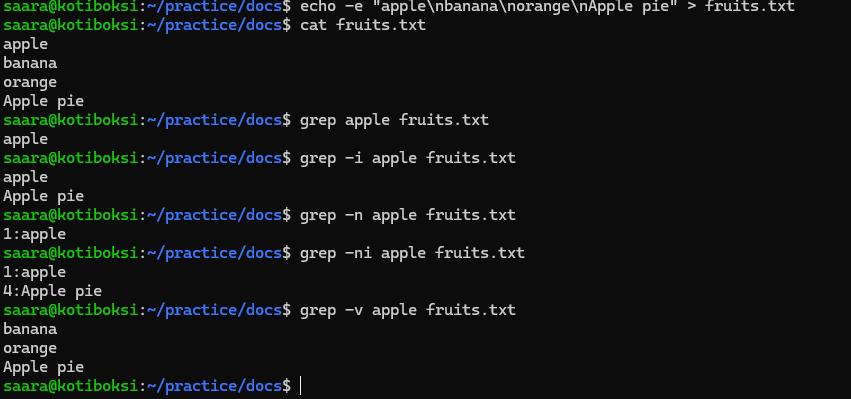
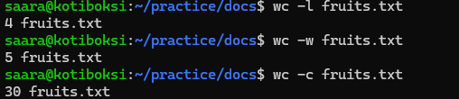
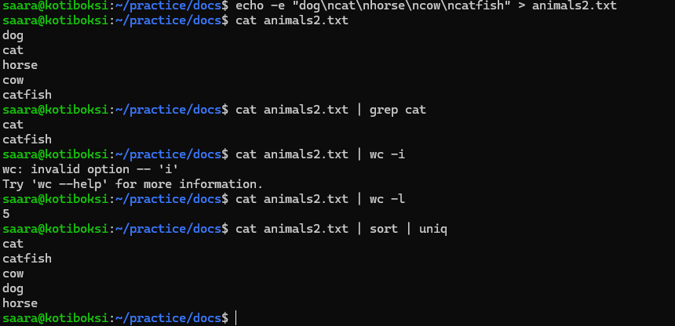

# Week 2

This document consists of a report of the tasks made on week 2.

## 1. Basic Commands

Creating the directories:

As seen above, I created the directory with the command `mkdir directory_name`

Creating the files:

As seen in the screenshot above, I created the files with the command `cat >filename.txt`

I checked the structure of the directories and files by using the command `tree`

I added content to text-files using the nano-editor using the command `nano file-name`

I renamed the files using the command `mv old-name new-name`

It took some time to figure out in which directory I should be and how to use the "~" mark when copying files from one directory to another. Finally got it to work:

I modified the animals.txt file using the nano editor:

I deleted the vegetables.txt file using the command `rm file-name`

Then I returned the original contents of the files from the backups directory:

Animals-file after recovery:

## Grep and Pipe

- Creating a text-file with some content, \n stands for line change `echo -e “apple\nbanana\norange\nApple pie” > fruits.txt`

- Looking for "apple" in the file: `grep apple fruits.txt`
- Looking for "apple" spelled anyhow: `grep -i apple fruits.txt`
- Looking for "apple" with the line number: `grep -n apple fruits.txt`
- Looking for "apple" spelled anyhow with line number: `grep -ni apple fruits.txt`
- Looking for anything else than "apple": `grep -v apple fruits.txt`

In the screenshot above the lines, words and characters in the file fruits.txt are counted.

- Looking for all words with "cat" in them: `cat animals2.txt | grep cat`
- Counting the lines: `cat animals2.txt | wc -l`
- Sorting the words in alphapetic order: `cat animals2.txt | sort | uniq`

- The GPL-2 license file contains 338 lines
- FInding all lines with the word "GNU": `grep GNU /usr/share/common-licenses/GPL-2`
- The word "GNU" appears on 8 lines
- Finding all lines with the wordh "license": `grep license /usr/share/common-licenses/GPL-2`
- Finding all lines with the word "license" (including capital letters): `grep -i license /usr/share/common-licenses/GPL-2`
