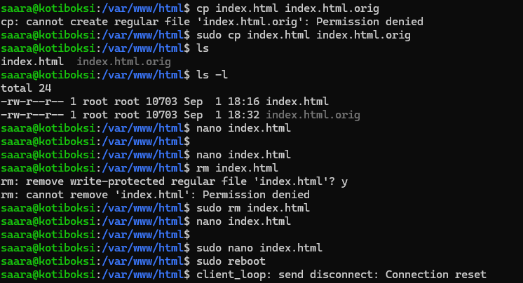
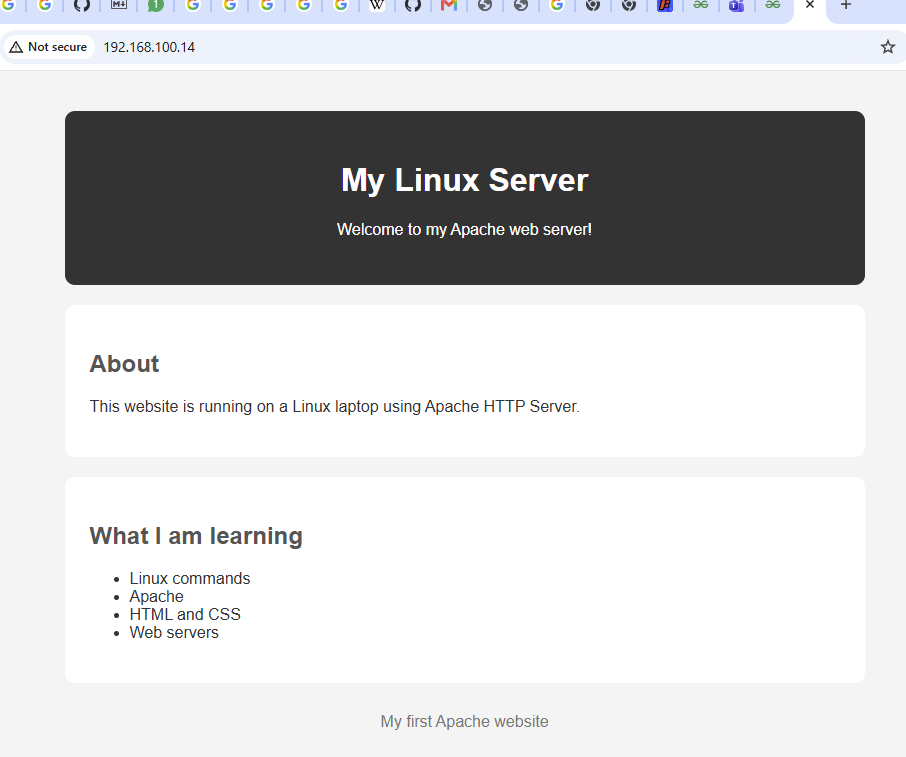

# Week 3: Apache

## Installing apache

sudo apt install apache2

Checking if apache is running:
`sudo systemctl status apache2`

Checking if apache will be running on reboot:
`sudo systemctl is-enabled apache2`

I edited the index-page using nano editor:

This is how my index-page looks like now:

